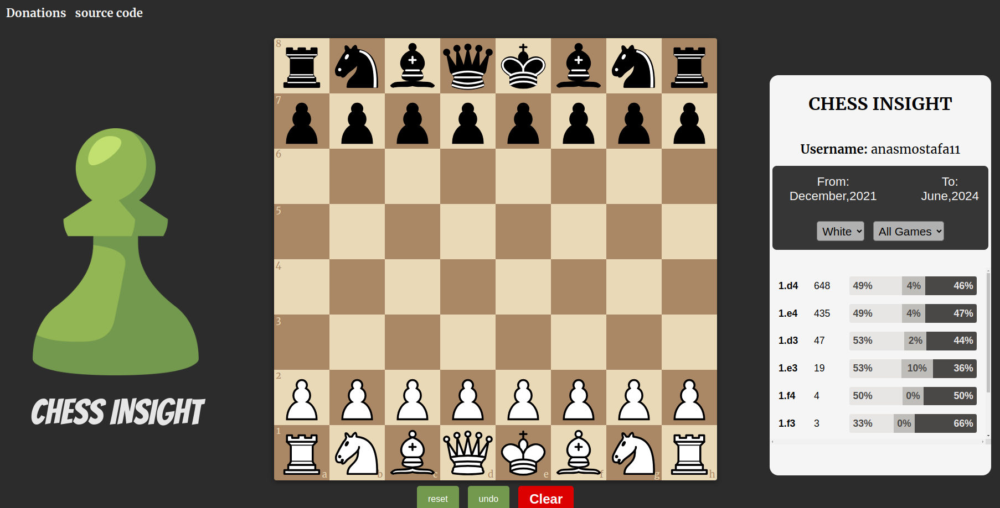
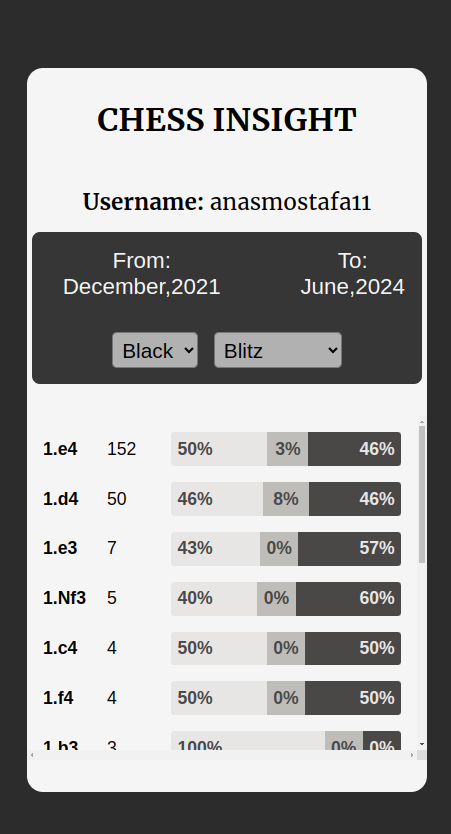
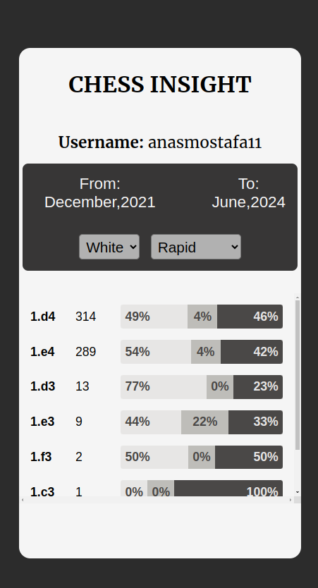

# [CHESS INSIGHT]()

## Description

**CHESS INSIGHT** is a free chess exploration tool inspired by chess.com's explorer feature, focusing on analyzing players' games.

## Inspiration

I love chess and i always wanted to improve my opening and i found the chess.com explorer option very interesting as it give u insight on your openings and gameplay tactics but unfortunately it's a premium feature and iam a broke college student :cry: so made my own implementation.

### Features

- Explore and analyze your games based on different game types.
- Filter games by blitz, bullet, and rapid formats.
- Load games from specific time periods for in-depth analysis.

## Screenshots

## Todo

- [ ] Integrate data loading from lichess alongside chess.com.
- [ ] Implement game visualization upon clicking a specific move or game line.

## Credits

- **chess.com public API**: Used for collecting player data.
- **[react-chessboard](https://github.com/Clariity/react-chessboard)**: React component for rendering the chessboard.
- **[chess.js](https://github.com/jhlywa/chess.js)**: JavaScript library for chess logic and move validation.

## Support :hugs: :hugs:

If you find **CHESS INSIGHT** helpful, consider supporting further development:

- [Buy Me a Coffee](https://ko-fi.com/anasmostafa)

## Getting Started

To get started with **CHESS INSIGHT**, simply clone the repository and follow these steps:

1. Install dependencies: `npm install`
2. Start the application: `npm start`

## Contributing

Contributions are welcome! Fork the repository and submit a pull request.

## License

This project is licensed under the [GNU General Public License (GPL)](LICENSE).
